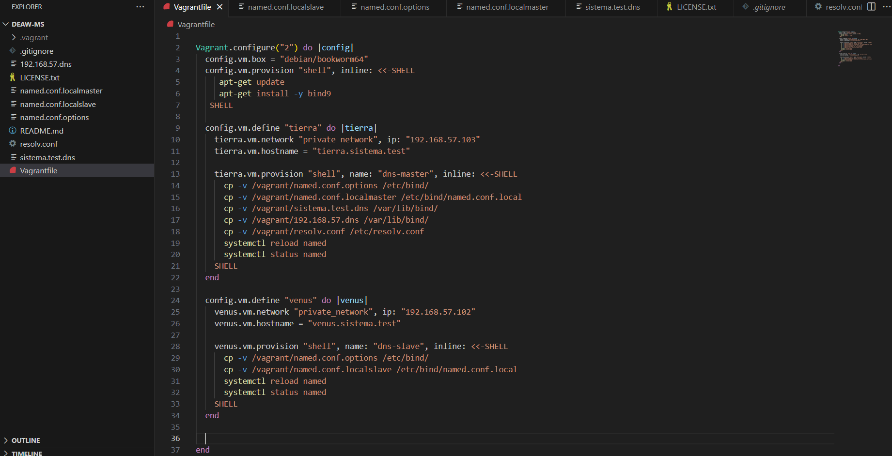
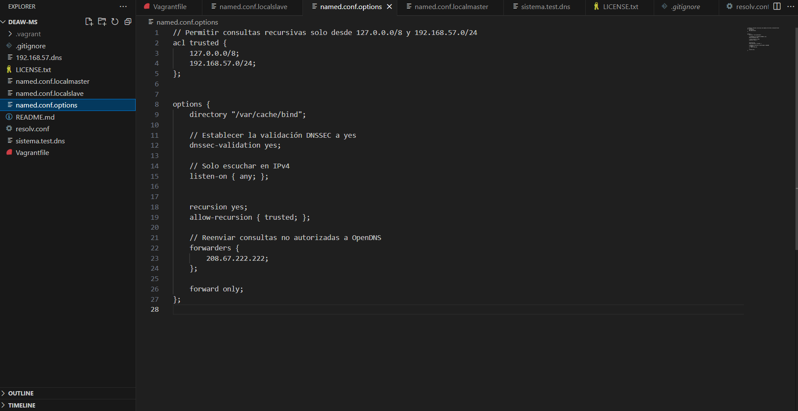
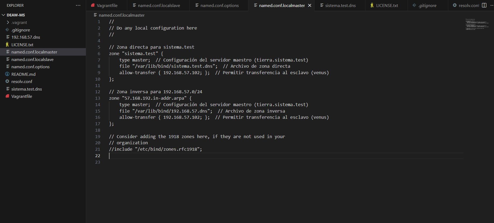
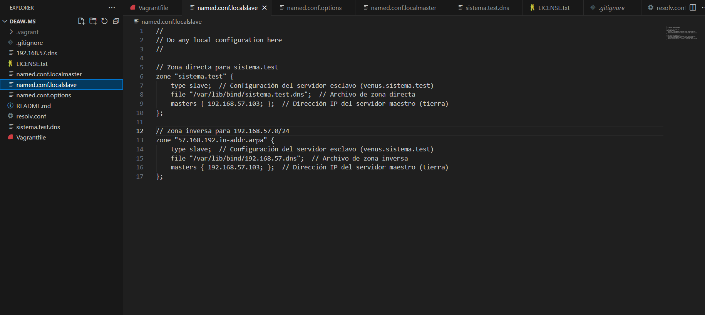
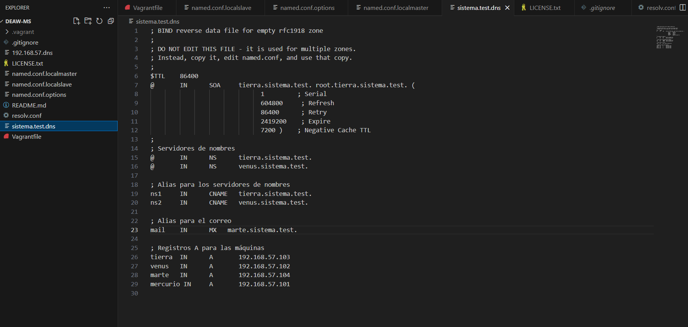
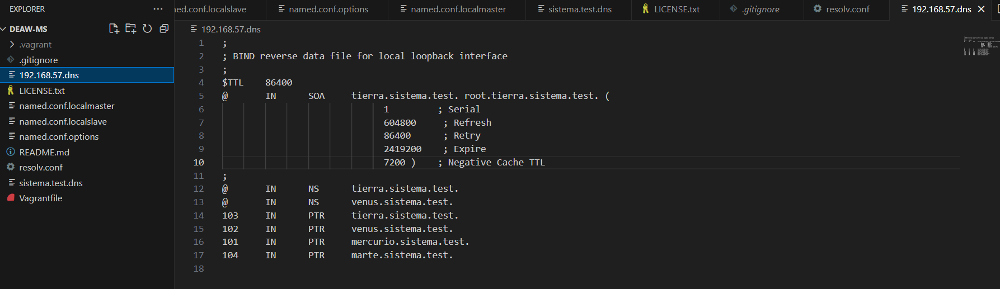
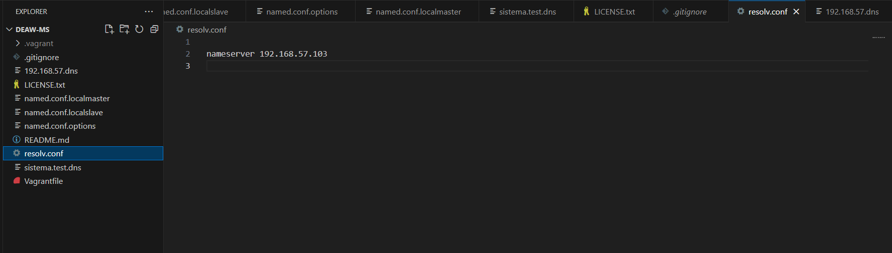

# deaw-MS

# Proyecto de Configuración de Servidor DNS con Vagrant y BIND

Este proyecto configura un entorno de servidor DNS maestro-esclavo usando **Vagrant** y **BIND9** en un entorno de red privado, simulando la infraestructura DNS para el dominio `sistema.test`.

## Descripción del Proyecto

El proyecto crea dos máquinas virtuales:
- **Tierra**: servidor DNS maestro para `sistema.test`.
- **Venus**: servidor DNS esclavo que recibe transferencias de zona desde el maestro.

### Requisitos Previos

- [Vagrant](https://www.vagrantup.com/) instalado en el sistema.
- [VirtualBox](https://www.virtualbox.org/) como proveedor de virtualización.
- Conocimientos básicos de BIND y configuración DNS.

### Configuración del Proyecto

Este proyecto crea las siguientes configuraciones de DNS:

1. **Zona directa e inversa**: Resuelve nombres de dominio como `tierra.sistema.test` a direcciones IP y viceversa.
2. **Validación DNSSEC**: La validación DNSSEC está habilitada en los servidores.
3. **Consultas recursivas**: Solo permitidas desde IPs en `127.0.0.0/8` y `192.168.57.0/24`.
4. **Aliases y registros de correo**: Se configura `mail.sistema.test` como alias para `marte.sistema.test`, y registros NS y MX para el dominio.

## Estructura de Archivos

- **Vagrantfile**: Define la infraestructura de red, las direcciones IP y el aprovisionamiento de las máquinas `tierra` y `venus`.
- **Archivos de Configuración BIND**:
  - **named.conf.options**: Configuración global de BIND (caché, validación, reenviadores).
  - **named.conf.localmaster**: Configuración de zonas para el servidor maestro.
  - **named.conf.localslave**: Configuración de zonas para el servidor esclavo.
  - **sistema.test.dns**: Zona directa para `sistema.test`.
  - **192.168.57.dns**: Zona inversa para la subred `192.168.57.0/24`.

## Contenido Final de los Archivos que Conforman el Proyecto
1. **Archivo Vagrant**: 
2. **Archivo named.conf.options**: 
3. **Archivo named.conf.localmaster**: 
4. **Archivo named.conf.localslave**: 
5. **Archivo sistema.test.dns**: 
6. **Archivo 192.168.57.dns**: 
7. **Archivo resolv.conf**: 

## Comprobaciones realizadas

- Se han realizado las siguientes pruebas para verificar la correcta configuración del servidor DNS:
1. **Registro A**: Verificar que los registros A resuelven correctamente a las direcciones IP.
2. **Resolución Inversa**: Confirmar que las direcciones IP se resuelven a los nombres de dominio.
3. **Alias**: Validar que los alias están funcionando correctamente.

- Consultas desde la MV maestra Tierra:
1. **Consulta de registros A** 

2. **Consulta de resolución inversa** 

3. **Consulta de alias** 

4. **Consulta de servidores de nombres (NS) y de de registros MX (servidores de correo)** |[Consulta de servidores de nombres (NS) y de de registros MX (servidores de correo)](imagenes/Comprobacion4)

- Consultas desde la MV esclava Venus:
1. **Consulta de registros A** 

2. **Consulta de resolución inversa** 

3. **Consulta de alias** 

4. **Consulta de servidores de nombres (NS) y de de registros MX (servidores de correo)** |[Consulta de servidores de nombres (NS) y de de registros MX (servidores de correo)](imagenes/Comprobacion8)

5.**Verificar transferencia de zona (AXFR) entre el servidor maestro y el esclavo:** 

## Autores y Créditos
Autor: Gema Sánchez Navarro
Fecha: Octubre 2024

---